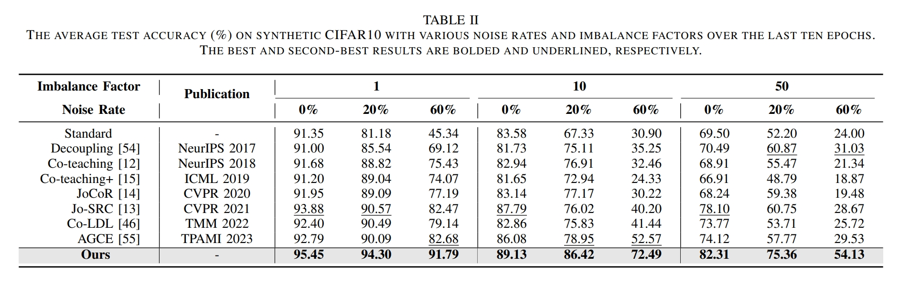
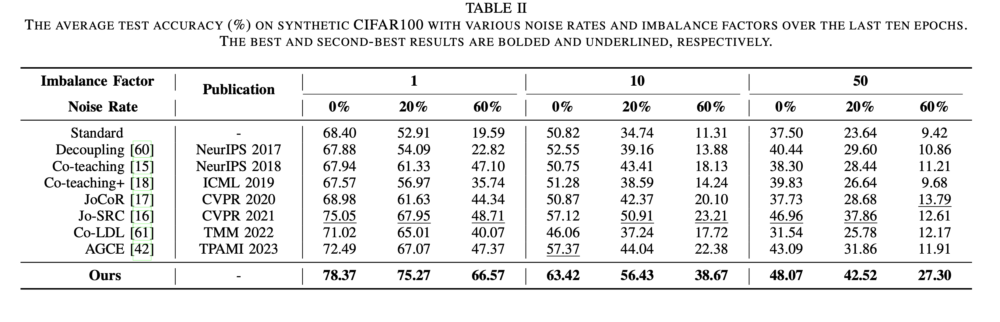
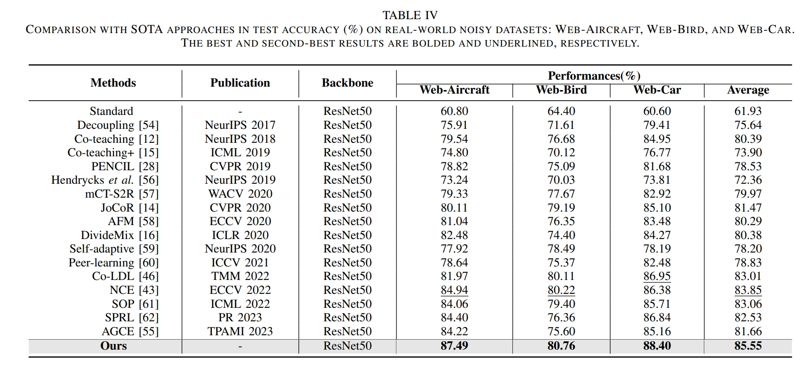

# Learning with Imbalanced Noisy Data by Preventing Bias in Sample Selection
**Abstract:** —Learning with noisy labels has gained increasing attention because the inevitable imperfect labels in real-world scenarios can substantially hurt the deep model performance. Recent studies tend to regard low-loss samples as clean ones and discard high-loss ones to alleviate the negative impact of noisy labels. However, real-world datasets contain not only noisy labels but also class imbalance. The imbalance issue is prone to causing failure in the loss-based sample selection since the under-learning of tail classes also leans to produce high losses. To this end, we propose a simple yet effective method to address noisy labels in imbalanced datasets. Specifically, we propose Class-Balance-based sample Selection (CBS) to prevent the tail class samples from being neglected during training. We propose Confidence-based Sample Augmentation (CSA) for the chosen clean samples to enhance their reliability in the training process. To exploit selected noisy samples, we resort to prediction history to rectify labels of noisy samples. Moreover, we introduce the Average Confidence Margin (ACM) metric to measure the quality of corrected labels by leveraging the model’s evolving training dynamics, thereby ensuring that low-quality corrected noisy samples are appropriately masked out. Lastly, consistency regularization is imposed on filtered label-corrected noisy samples to boost model performance. Comprehensive experimental results on synthetic and real-world datasets demonstrate the effectiveness and superiority of our proposed method, especially in imbalanced scenarios.

# Pipeline


# Installation
```
pip install -r requirements.txt
```

# Datasets
Currently three datasets are supported: CIFAR10, CIFAR100 and Clothing1M
Synthetic datasets are mainly derived from CIFAR10 and CIFAR100. 
To further verify the feasibility and effectiveness of our method in practical scenarios, we conduct experiments on a real-world dataset (\ie, Clothing1M)

You can download the CIFAR10 and CIFAR100 on [this](https://www.cs.toronto.edu/~kriz/cifar.html).

You can download the Clothing1M from [here](https://github.com/lightas/Occluded-DukeMTMC-Dataset).

# Training

Here is an example shell script to run CBS on CIFAR-10 :

```python
python main.py  --closeset-ratio 0.6 --rho-range 0.8:0.7:100 --dataset cifar10 --imb-factor 0.02 --gpu 0
```

Here is an example shell script to run CBS on CIFAR-100 :

```python
python main.py --closeset-ratio 0.6 --rho-range 0.8:0.7:100 --dataset cifar100 --imb-factor 0.02 --gpu 0
```

Here is an example shell script to run CBS on CIFAR-100 :

```python
 python main_web.py --rho-range 0.9:0.8:30 --dataset web-bird --gpu 0
```

# Results on Cifar10.

# Results on Cifar100.

# Results on Web-Aircraft, Web-Bird, and Web-Car.

