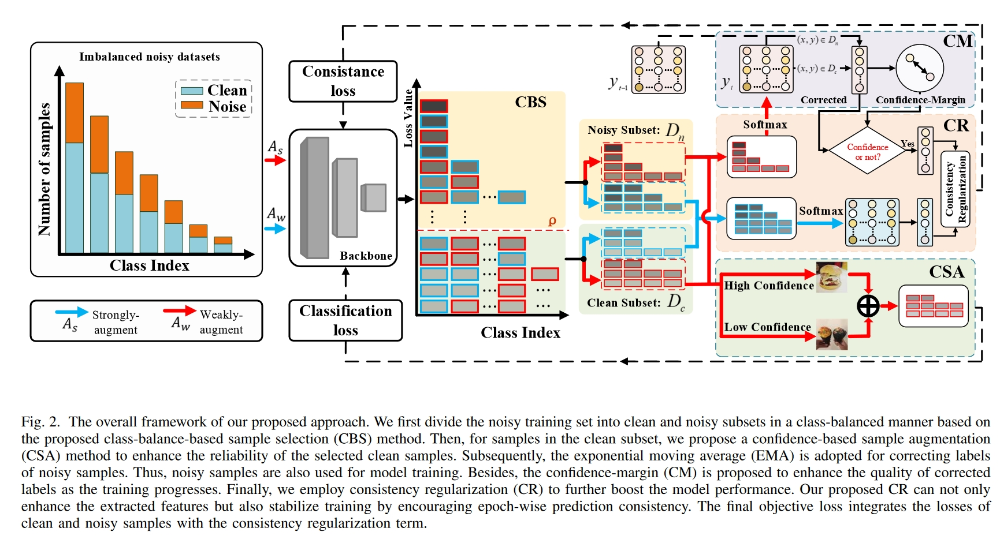

# CBS: Robust Learning with Noisy and Imbalanced Labels
**Abstract:** —Learning with noisy labels has gained increasing attention because imperfect labels are inevitable in real-world scenarios and substantially hurt the deep model performance. Recent studies tend to regard low-loss samples as clean ones and discard high-loss ones to alleviate the negative impact of noisy labels. However, real-world datasets contain not only noisy labels but also class imbalance. The imbalance issue is prone to causing failure in the loss-based sample selection since the under-learning of tail classes also leans to produce high losses. To this end, we propose a simple yet effective method to address noisy labels in imbalanced datasets. Specifically, we propose Class-Balance-based sample Selection (CBS) to prevent the tail class samples from being neglected in the training process. We propose Confidence-based Sample Augmentation (CSA) for the chosen clean samples to enhance their reliability in the training process. Besides, we employ Consistency Regularization (CR), which is designed to encourage sample-view-wise and epoch-wise prediction consistency to maximize data exploitation and boost model performance further. Lastly, we further introduce the Confidence-Margin (CM) metric to measure the quality of corrected labels by leveraging the model’s evolving training dynamics, thereby ensuring that low-quality corrected samples are appropriately masked out. Comprehensive experimental results on synthetic and real-world datasets demonstrate the effectiveness and superiority of our proposed method, especially on imbalanced datasets.

# Pipeline



# Installation
```
pip install -r requirements.txt
```

# Datasets
Currently three datasets are supported: CIFAR10, CIFAR100 and Clothing1M
Synthetic datasets are mainly derived from CIFAR10 and CIFAR100. 
To further verify the feasibility and effectiveness of our method in practical scenarios, we conduct experiments on a real-world dataset (\ie, Clothing1M)

You can download the CIFAR10 and CIFAR100 on [this](https://www.cs.toronto.edu/~kriz/cifar.html).

You can download the Clothing1M from [here](https://github.com/lightas/Occluded-DukeMTMC-Dataset).

# Training

Here is an example shell script to run CBS on CIFAR-10 :

```python
 python main.py --warmup-epoch 40 --epoch 250 \
        --rho-range 0.6:0.6:100 --batch-size 128 \
        --lr 0.05 --warmup-lr 0.01 --start-expand 200 --noise-type unif \
        --closeset-ratio 0.4 --lr-decay cosine:40,5e-5,240 \
        --opt sgd --dataset cifar10 --imbalance True --imb-factor 0.05 --alpha 0.6 --aph 0.35
```
# Results on Cifar10 and Cifar100

| Datasets               |  Cifar10               |   Cifar100                | 
|:-----------------------|:-----------------------|:--------------------------|
|  IF                    | [1,10,20,50,100,200]   |    [1,10,20]              |
|  NR                    |  [0.0,0.2,0.4]         |     [0.0,0.2,0.4,0.6]     |
|  CE                    |  74.49                 | 46.76                     |
|  Class-Balanced        |63.49                   |     42.81                 |
|  Focal                 |71.59                   |         43.85             |
|  LDAM-DRW              |  73.46                 |         45.47             |
|Co-teaching             |  60.63                 |         36.55             |
|O2U                     |  65.01                 |         40.21             |
|MW-Net                  |  74.13                 |         49.28             |
|HAR                     | 73.50                  |          42.88            |
|CurveNet                |  75.70                 | 50.49                     |
|Ours                    |78.47                   |     52.94                 |

